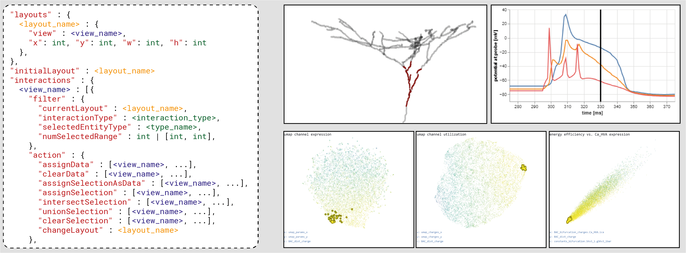

# Coordinated Views -- A Grammar-based Approach
## About

Supports the creation of web-based data analytics dashboards consisting of linked views. Key features:
- Combine InfoVis and SciVis views
- Integrate different JavaScript visualization libraries (e.g., Vega-Lite, Plotly.js, Babylon.js)
- Specify layout and interactions with a JSON-based grammar

## Running the application
Please refer to the readme-files in the frontend and backend folders.

### Cite as
Rapid Prototyping for Coordinated Views of Multi-scale Spatial and Abstract Data: A Grammar-based Approach.
Philipp Harth, Arco Bast, Jakob Troidl, Bjorge Meulemeester, Hanspeter Pfister, Johanna Beyer, Marcel Oberlaender, Hans-Christian Hege, Daniel Baum
<i>Eurographics Workshop on Visual Computing for Biology and Medicine (VCBM)</i>, 2023.
